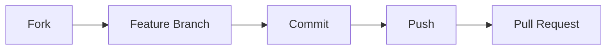

<div align="center">

# 🚢 Titanic Machine Learning Project

[](https://www.python.org)
[](https://streamlit.io)
[](https://xgboost.readthedocs.io/)
[](LICENSE)

---

<p align="center">
  <strong>Machine Learning interattivo sul dataset Titanic con UI moderna ed esperimenti avanzati</strong>
</p>

[Esplora](#overview) • 
[Risultati](#risultati) • 
[Installazione](#installazione) • 
[Documentazione](#documentazione) • 
[Contribuisci](#contribuisci)

</div>

---

## 📋 Indice
- [Overview](#overview)
- [Risultati Sperimentali](#risultati-sperimentali)
- [Struttura Progetto](#struttura-progetto)
- [Installazione](#installazione)
- [Applicazione Streamlit](#applicazione-streamlit)
- [Dataset](#dataset)
- [Tecnologie](#tecnologie)
- [Best Practices](#best-practices)
- [Contribuire](#contribuire)
- [Licenza](#licenza)

---

## 🎯 Overview

> Un'applicazione completa di Machine Learning che combina esperimenti avanzati con un'interfaccia utente moderna per l'analisi e la predizione della sopravvivenza sul Titanic.

### ✨ Caratteristiche Principali
* 🔄 Training modello interattivo
* 📊 Visualizzazioni dinamiche
* 🛠️ Feature engineering automatizzato
* 📈 Multiple submission ottimizzate
* 🎨 UI moderna e responsive

---

## 📊 Risultati Sperimentali

### 🏆 Performance Submissions

<table>
<thead>
  <tr>
    <th>Submission</th>
    <th>Score</th>
    <th>Caratteristiche</th>
  </tr>
</thead>
<tbody>
  <tr>
    <td><code>submission_advanced_features.csv</code></td>
    <td><b>0.77751</b></td>
    <td>
      • Random Forest (200 trees)<br>
      • Max depth: 7<br>
      • Feature engineering avanzato
    </td>
  </tr>
  <tr>
    <td><code>submission_optimized.csv</code></td>
    <td>0.75598</td>
    <td>
      • XGBoost ottimizzato<br>
      • Hyperparameter tuning<br>
      • Feature avanzate
    </td>
  </tr>
  <tr>
    <td><code>submission.csv</code></td>
    <td>0.61722</td>
    <td>
      • Random Forest base<br>
      • Feature engineering minimo
    </td>
  </tr>
  <tr>
    <td><code>submission_with_isalone.csv</code></td>
    <td>0.60047</td>
    <td>
      • Feature IsAlone aggiunta<br>
      • Encoding binario cabine
    </td>
  </tr>
</tbody>
</table>

---

## 📁 Struttura Progetto

```ascii
TITANIC_ML/
│
├── 📱 titanic_app.py           # App Streamlit
├── 📊 generate_submission.py   # Script base
├── 📈 generate_submission_adv.py  # Features avanzate
├── 🔧 generate_submission_pro.py  # Ottimizzazione
├── 📝 titanic_eda.py          # Analisi dati
│
├── 📂 data/
│   ├── train.csv              # Training set
│   ├── test.csv               # Test set
│   └── train_cleaned.csv      # Dati preprocessati
│
├── 📦 models/
│   └── xgboost_model.pkl      # Modello salvato
│
└── 📄 requirements.txt        # Dipendenze
```

---

## ⚡ Installazione

```bash
# Clone repository
git clone https://github.com/yourusername/titanic_ml.git

# Crea ambiente virtuale
python -m venv venv

# Attiva ambiente
source venv/bin/activate  # Linux/Mac
venv\Scripts\activate     # Windows

# Installa dipendenze
pip install -r requirements.txt

# Avvia app
streamlit run titanic_app.py
```

---

## 💻 Applicazione Streamlit

<table>
<tr>
<td width="50%">

### Features
* 📊 Dashboard interattiva
* 🔄 Training real-time
* 📈 Visualizzazioni dinamiche
* 💾 Export predizioni
* 🎨 Tema dark mode

</td>
<td width="50%">

### Metriche
* 📈 Accuratezza: 84.9%
* 🎯 Precisione: 82.2%
* 📊 Recall: 81.1%
* 🏆 Score Kaggle: 0.77751

</td>
</tr>
</table>

---

## 🛠️ Tecnologie

<table>
<tr>
<td width="33%">
<h4>Core</h4>

* Python 3.8+
* Pandas
* NumPy
* Scikit-learn
* XGBoost
</td>
<td width="33%">
<h4>Visualization</h4>

* Streamlit
* Plotly
* Seaborn
* Matplotlib
</td>
<td width="33%">
<h4>Development</h4>

* Git
* Virtual Env
* Jupyter
</td>
</tr>
</table>

---

## 📈 Performance e Ottimizzazione

### Hardware Consigliato
* 💻 RAM: 4GB+
* 🔧 CPU: Multi-core
* 💾 Disk: 1GB+

### Tempi Esecuzione
* ⚡ Training: 1-2 min
* 🚀 Predizione: Real-time
* 📊 EDA: Istantaneo

---

## 🤝 Come Contribuire



---

## 📫 Contatti

<div align="center">

[](https://github.com/fracabu)
[](https://linkedin.com/in/yourprofile)

</div>

---

<div align="center">

## 📄 Licenza

MIT © [Francesco Cabu](LICENSE)

</div>
